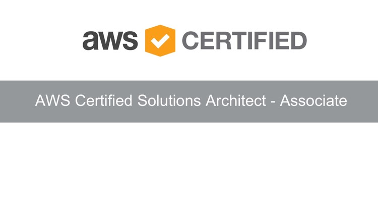

# AWS Solutions Architect Course Review - Day 1

## Introduction

Doing a course review of some important content.

#### Duration

About 3 hours.

## Use Case

- The topics reviewed are part of original course and were extracted from course material

### Microservices, ECS and EKS

- Microservices are Autonomous, Specialyzed, responsible for one topic
- AWS Container Services: AWS solution to run and manage containers
- AWS Container Competency Program: a Partner Program to certify Partner's solutions running on AWS platform
- Container: repeatable, self-contained environment and fast to start/stop
- AWS ECS: AWS automatically distributes container instances into more than node of ECS cluster, to give high availability to application.
- Fargate: fully maaged container service, provisioning and managing the EKS or ECS clusters, without any infrasctructure administration needs.

### AWS Lambda
- Fully managed compute service
- Stateless code
- Node.js, Java, Python, C#, Go, Ruby and PowerShell
- Run the code in a schedule or in response to an event, like file upload to a S3 bucket, change in a DynamoDB, API request, etc
- By default Lambda does not have permissions to comunicate woth any other services, and is up to you creates an IAM Role to allow it as you need. By default Lambda requires CloudFront permissions to upload logs to.
- AWS Lambda handles: Servers, capacity needs, deployment, scaling and fault tolerance, OS and language updates, metrics and logging

### AWS API Gateway
- Act as "front doors" for applications
- Can handle up to hundreds of thousands of concurrent API calls
- Can work with workloads running on Lambda or any web application platform

### AWS Step Functions 
- Is a State Machine that can be used to coordinate microservices using visual workflow
- Automatically triggers and tracks each step, providing simpe error catching and logging
- State Machine can be represented using Amazon State Language, a JSON format language that defines the behavior of an state machine

### Where to learn more: 
[AWS FAQs](https://aws.amazon.com/faqs/)

## Social Proof

[Twitter](https://twitter.com/cicerosilvajr/status/1284860215502897153)
