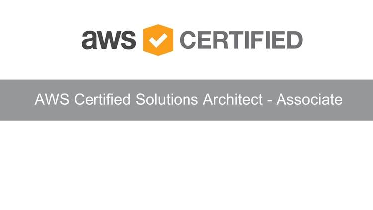

# AWS Solutions Architect Course Review - Day 2

## Introduction

Doing a course review of some important content.

#### Duration

About 1 hour.

## Use Case

- The topics reviewed are part of original course and were extracted from course material

### S3, Lambda, DynamoDB, SNS, Cognito

- Reviewing a video demo using S3 events do trigger a Lambda Function that upoad file content from S3 to DynamoDB, and uses SNS to send a SMS message when an event occurs.

### Where to learn more: 
[AWS FAQs](https://aws.amazon.com/faqs/)

## Social Proof

[Twitter](https://twitter.com/cicerosilvajr/status/1285760149437775876)
